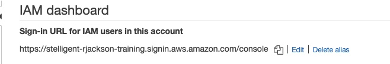
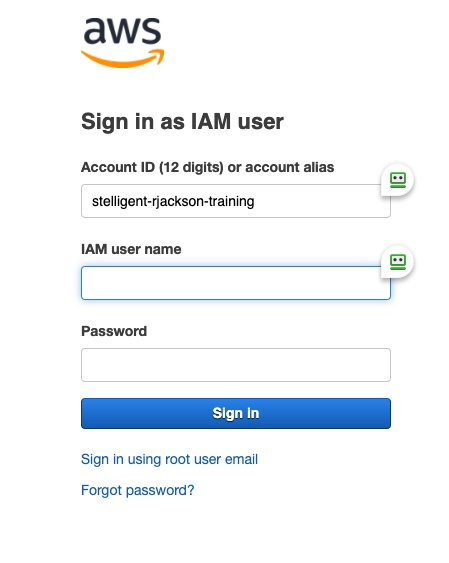
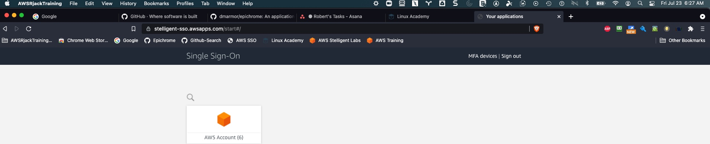

# Ideas and Stratgies for AWS Console Identity Switching
Ideas and strategies to handle AWS console access across multiple accounts.

The White Squirrel  
 .  

Frustration free AWS Console access can be a rarity. AWS built it for security; not for speed or ease.

## The Session/Cookie Problem

AWS uses sessions and cookies to determine your current identity.

Usually each browser window can only work wth one account/identity at a time.

So if you have many AWS accounts to work with, it can be tedious logging in and out over and over all day.

Site Specific Browser apps like Epichrome and Firefox Multicontainer can help
manage your workload.

An SSB allows like Epichrome allows you to create a "Browser Application" for one or more sites.

## Definitions
- SSB : Site Specific Browsers
- AWS Idenity : IAM User, IAM Role, Federation Role, etc..

## Helpful AWS Chrome Extensions
### AWS Extend Switch Roles
Allows you to easily switch AWS roles/profiles.

- Supports the Sync feature on all sorts of browsers
- Not support switching between AWS accounts you sign into with AWS SSO or SAML solution providers directly

### Tab Resize - split screen layouts
Great for resizing browsing windows.

### FreshStart - Cross Browser Session Manager
- Save multiple windows into a single session
- Save all open tabs to a new session, or hand select what to be saved

### Tab-Snap
Easy to copy tabs between windows.

### Password Manager of Choice
I use Roboform

## Helpful AWS Firefox Extensions

### Firefox Multi-Account Containers
- Magic that makes kinda like an SSB but not really
### AWS Extend Switch Roles
Allows you to easily switch AWS roles/profiles.

- Supports the Sync feature on all sorts of browsers
- Not support switching between AWS accounts you sign into with AWS SSO or SAML solution providers directly

### Window Layout Resizer
Great for resizing browsing windows.

### Tab Session Manager

### Tab Stash

### Password Manager of Choice
I use Roboform

## Tabs You May Need in Each Window
I also usually bookmark this sites too.

1) Google Advanced Search  
[Google Search](https://www.google.com/advanced_search?hl=en&num=100)

2) Project Management Tab
- JIRA
- Asana  
[Asana](https://app.asana.com)

3) Github Search Window  
[Github Search](https://github.com/search/advanced)

4) Github  
[github](https://github.com/)

5) Client Github URL  
https://github.thebestclient.com

6) Other ??   

7) AWS Console URL for Stelligent/Client
- Your AWS URL
- Landing zone : https://stelligent-sso.awsapps.com/start
- Stelligent Labs : https://stelligentlabs.signin.aws.amazon.com/console

## Customizing your AWS Account Sign-in URL

These is really handy for AWS accounts that aren't using Federation, SSO, SAML etc.
Makes it faster/easier to work with multiple sites.

## Example SSB Setup

## Example SSB Strategies

May not be the best strategy to have an SSB for each AWS account/Role.

It reall depends on how much you use an account and how how you use it.

It does take some time to create and maintain each SSB.
Also using lots of SSBs can consume quite a bit of system resources.
### AWS Networking
I use this stragegy at 3M. I use the AWS Extend Switch extension to switch between accounts shared on a SSB.

Federated login allows you to easily assume roles in many diferent accounts.

1) Regional Networking
- Separate SSB for each production region
- One Dev SSD for all Dev Regional Netowrks
2) Workload Networking Role
- one SSB for Prod Workloads
- one SSB for Dev Workloads
3) Tools Account Role
- SSB for Prod, SSB for Dev
4) CTower Role
- SSB for Prod, SSB for Dev
5) AWS Mirror Console
- SSB for a "Mirror" console, for Comparison

### Organizational Roles
1) Admin
2) Billing
3) Engineers

## SSB TOols
1) Epichrome
- [Epicrhome](https://github.com/dmarmor/epichrome)
- My favorite SSB for Mac
- Developer has announced he's done at the end of the Year
2) Coherence
- [Coherence](https://www.bzgapps.com/coherence)
- $30
- Will Probably move to this one
3) Firefox Multi-Account

## Other Tools

### Divvy
Window management on Mac/Windows.
[Divvy](https://mizage.com/windivvy/)

### Authy
- Very efficient MFA
- [Authy](https://authy.com/)
- Twilio
